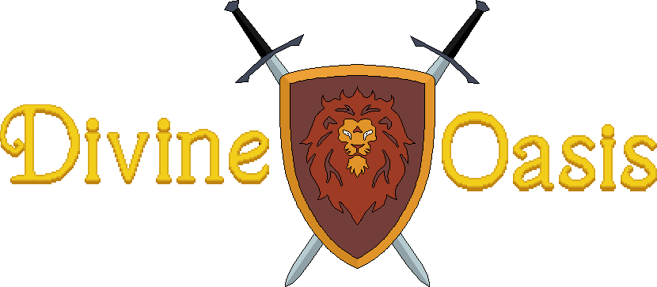

# Divine Oasis RPG

A to-be RPG written in python

Check out the GitHub Project page [Here](https://github.com/wsngamerz/Divine-Oasis-RPG/projects/1) to find out current progress!

## Attribution

'Italo Unlimited', 'Super Ninja Assasin' and 'Power of thy yes' written and produced by Ove Melaa (Omsofware@hotmail.com)

'Hydrophilla' Font designed by Felix Braden (<http://www.floodfonts.com/freefont/hydrophi.html>)

##### Helpful Websites:

-   <http://www.fearrpg.net/FEAR_RPG.pdf>
-   <https://www.aonprd.com/>
